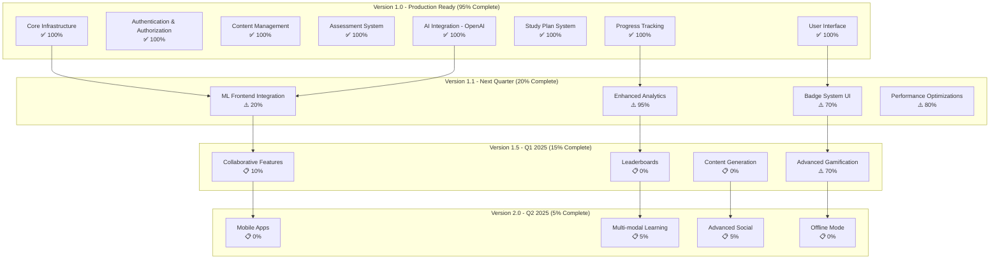

# StudyGPT - Feature Roadmap & Status



---

## 📊 Feature Completion Matrix

| Category | Feature | Status | Completion | Priority |
|----------|---------|--------|------------|----------|
| **Core** | User Authentication | ✅ Complete | 100% | P0 |
| **Core** | Database Architecture | ✅ Complete | 100% | P0 |
| **Core** | Frontend Framework | ✅ Complete | 100% | P0 |
| **Core** | API Layer | ✅ Complete | 100% | P0 |
| **Content** | Subjects & Topics | ✅ Complete | 100% | P0 |
| **Content** | Question Bank | ✅ Complete | 100% | P0 |
| **Assessment** | Quiz System | ✅ Complete | 100% | P0 |
| **Assessment** | Mock Test Engine | ✅ Complete | 100% | P0 |
| **Progress** | Dashboard Analytics | ✅ Complete | 100% | P0 |
| **Progress** | Progress History | ✅ Complete | 100% | P0 |
| **Progress** | Weak Areas Detection | ✅ Complete | 100% | P0 |
| **Study Plan** | AI Plan Generation | ✅ Complete | 100% | P0 |
| **Study Plan** | Templates | ✅ Complete | 100% | P0 |
| **Study Plan** | Adherence Tracking | ✅ Complete | 100% | P0 |
| **Study Plan** | Milestones | ✅ Complete | 100% | P0 |
| **AI** | OpenAI Integration | ✅ Complete | 100% | P0 |
| **AI** | Recommendations | ✅ Complete | 100% | P0 |
| **AI** | AI Tutor | ✅ Complete | 100% | P0 |
| **ML Backend** | Knowledge Tracing | ✅ Backend Ready | 95% | P1 |
| **ML Backend** | Spaced Repetition | ✅ Backend Ready | 95% | P1 |
| **ML Backend** | Adaptive Testing | ✅ Backend Ready | 95% | P1 |
| **ML Backend** | Performance Prediction | ✅ Backend Ready | 95% | P1 |
| **ML Backend** | Emotional Intelligence | ✅ Backend Ready | 95% | P1 |
| **ML Backend** | NLP Query | ✅ Backend Ready | 95% | P1 |
| **ML UI** | Adaptive Test Interface | ⚠️ In Progress | 20% | P1 |
| **ML UI** | Spaced Rep Scheduler | ⚠️ In Progress | 20% | P1 |
| **ML UI** | Knowledge Graph Viz | ⚠️ In Progress | 10% | P2 |
| **Analytics** | Enhanced Dashboards | ⚠️ In Progress | 95% | P1 |
| **Analytics** | Predictive Insights | ⚠️ In Progress | 80% | P1 |
| **Gamification** | Badge System | ⚠️ In Progress | 70% | P1 |
| **Gamification** | Achievements | ⚠️ In Progress | 70% | P1 |
| **Gamification** | Leaderboards | 📋 Planned | 0% | P2 |
| **Social** | Peer Comparison | 📋 Planned | 10% | P2 |
| **Social** | Study Groups | 📋 Planned | 0% | P2 |
| **Social** | Discussion Forums | 📋 Planned | 0% | P3 |
| **Content Gen** | AI Questions | 📋 Planned | 0% | P2 |
| **Content Gen** | Personalized Explanations | 📋 Planned | 0% | P2 |
| **Multi-modal** | Video Content | 📋 Planned | 0% | P3 |
| **Multi-modal** | Audio Lessons | 📋 Planned | 0% | P3 |
| **Multi-modal** | Interactive Simulations | 📋 Planned | 0% | P3 |
| **Mobile** | iOS App | 📋 Planned | 0% | P2 |
| **Mobile** | Android App | 📋 Planned | 0% | P2 |
| **Mobile** | Offline Mode | 📋 Planned | 0% | P2 |
| **Testing** | Unit Tests | 📋 Planned | 0% | P1 |
| **Testing** | Integration Tests | 📋 Planned | 0% | P1 |
| **Testing** | E2E Tests | 📋 Planned | 0% | P2 |

**Legend:**
- ✅ Complete - Feature is production-ready
- ⚠️ In Progress - Feature is partially implemented
- 📋 Planned - Feature is planned but not started
- P0 - Critical (must-have for v1.0)
- P1 - High Priority (should-have for v1.1)
- P2 - Medium Priority (nice-to-have for v1.5)
- P3 - Low Priority (future consideration)

---

## 🎯 Milestone Timeline

### Q4 2024 - Version 1.0 (Current)
**Target Date**: October 2024
**Status**: 95% Complete ✅

**Completed:**
- ✅ All core features
- ✅ AI integration (OpenAI)
- ✅ ML backend infrastructure
- ✅ Comprehensive documentation

**Remaining:**
- ⚠️ ML UI integration (5%)
- ⚠️ Enhanced analytics (5%)

### Q4 2024 - Version 1.1
**Target Date**: November-December 2024
**Status**: 20% Complete

**Goals:**
- ML features visible in UI
- Enhanced analytics dashboard
- Badge system completion
- Performance optimizations
- User testing feedback integration

**Estimated Effort**: 4-6 weeks

### Q1 2025 - Version 1.5
**Target Date**: January-March 2025
**Status**: 15% Complete

**Goals:**
- Basic collaborative features
- Leaderboards
- Content generation system
- Advanced gamification
- Social learning features

**Estimated Effort**: 8-10 weeks

### Q2 2025 - Version 2.0
**Target Date**: April-June 2025
**Status**: 5% Complete

**Goals:**
- Mobile apps (iOS/Android)
- Multi-modal learning content
- Advanced social features
- Offline mode
- Enhanced personalization

**Estimated Effort**: 12-16 weeks

---

## 📈 Progress Visualization

### Overall Progress
```
Version 1.0:  [████████████████████▓] 95%
Version 1.1:  [████░░░░░░░░░░░░░░░░] 20%
Version 1.5:  [███░░░░░░░░░░░░░░░░░] 15%
Version 2.0:  [█░░░░░░░░░░░░░░░░░░░]  5%
```

### Feature Categories
```
Core Infrastructure:    [████████████████████] 100%
Content Management:     [████████████████████] 100%
Assessment System:      [████████████████████] 100%
Progress Tracking:      [████████████████████] 100%
Study Plan System:      [████████████████████] 100%
AI/ML Backend:          [███████████████████░]  95%
UI/UX:                  [████████████████████] 100%
Analytics:              [███████████████████░]  95%
Gamification:           [██████████████░░░░░░]  70%
Social Features:        [██░░░░░░░░░░░░░░░░░░]  10%
Mobile:                 [░░░░░░░░░░░░░░░░░░░░]   0%
Multi-modal Learning:   [█░░░░░░░░░░░░░░░░░░░]   5%
```

### By Priority
```
P0 (Critical):      [████████████████████] 100%
P1 (High):          [█████████████████░░░]  85%
P2 (Medium):        [████░░░░░░░░░░░░░░░░]  20%
P3 (Low):           [█░░░░░░░░░░░░░░░░░░░]   5%
```

---

## 🚦 Status Key

### Feature Status Definitions

#### ✅ Complete (100%)
- Feature is fully implemented
- Tested and working in production
- Documentation complete
- No known critical bugs

#### ⚠️ In Progress (1-99%)
- Feature is partially implemented
- May be functional but incomplete
- Requires additional work
- May have known issues

#### 📋 Planned (0%)
- Feature is designed but not implemented
- May have specifications
- Scheduled for future release
- Resources allocated

---

## 🎯 Success Metrics

### Version 1.0 Success Criteria ✅
- [x] All core features operational
- [x] User authentication working
- [x] Quiz and mock test system functional
- [x] Progress tracking accurate
- [x] AI recommendations generating
- [x] Study plans creating successfully
- [x] Dashboard displaying correctly
- [x] Analytics showing insights
- [x] Documentation complete
- [x] Ready for production deployment

### Version 1.1 Success Criteria
- [ ] ML features integrated in UI
- [ ] Adaptive testing available to users
- [ ] Enhanced analytics dashboard live
- [ ] Badge system fully functional
- [ ] 90%+ feature completion
- [ ] User feedback incorporated
- [ ] Performance benchmarks met

### Version 1.5 Success Criteria
- [ ] Leaderboards operational
- [ ] Basic peer comparison working
- [ ] Content generation active
- [ ] Social features launched
- [ ] User engagement metrics tracked
- [ ] 85%+ planned features complete

### Version 2.0 Success Criteria
- [ ] Mobile apps in app stores
- [ ] Offline mode functional
- [ ] Multi-modal content available
- [ ] Cross-platform sync working
- [ ] User base grown 10x
- [ ] 90%+ planned features complete

---

## 📊 Development Velocity

### Sprint Metrics (Estimated)

**Current Velocity**: ~15-20 story points per week

**Version 1.0 Completion**: ~12 weeks completed
**Version 1.1 Estimated**: 4-6 weeks
**Version 1.5 Estimated**: 8-10 weeks
**Version 2.0 Estimated**: 12-16 weeks

**Total Development Time (to v1.0)**: ~3 months
**Projected Time (to v2.0)**: ~9-12 months total

---

## 🎓 Team Recommendations

### Immediate Actions (Next 2 Weeks)
1. ✅ Deploy Version 1.0 to production
2. 🔄 Begin user testing
3. 🔄 Integrate ML features in UI
4. 🔄 Gather user feedback
5. 🔄 Fix critical bugs

### Short-term Actions (Next 1-2 Months)
1. Complete ML UI integration
2. Enhance analytics dashboard
3. Implement badge system
4. Add rate limiting
5. Set up CI/CD pipeline
6. Add automated testing

### Medium-term Actions (Next 3-6 Months)
1. Develop collaborative features
2. Implement leaderboards
3. Build content generation system
4. Start mobile app development
5. Expand user base
6. Gather analytics data

### Long-term Actions (Next 6-12 Months)
1. Launch mobile apps
2. Implement multi-modal learning
3. Expand social features
4. Add offline capabilities
5. Scale infrastructure
6. Internationalization

---

**Last Updated**: October 2024
**Version**: 1.0 (RC)
**Overall Completion**: 95%
**Status**: Production Ready ✅
